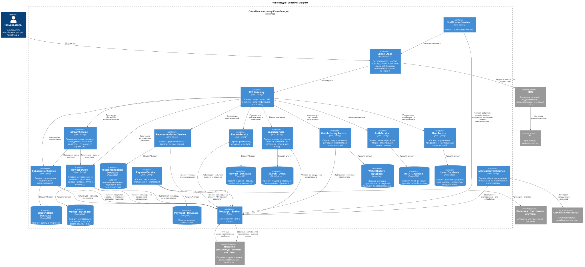
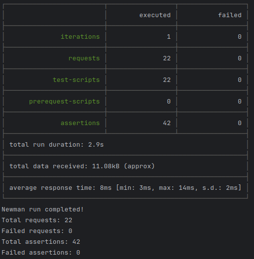
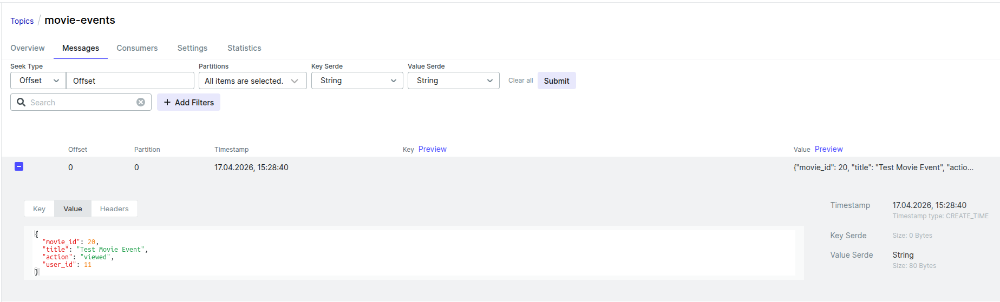
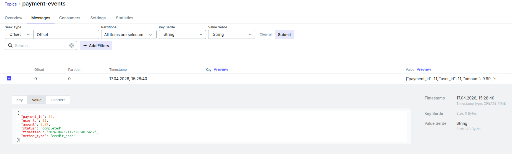
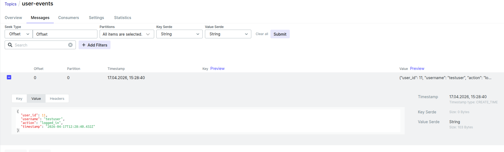
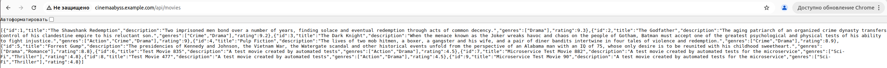
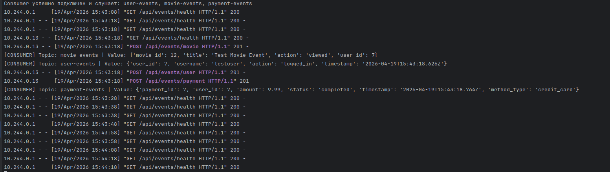
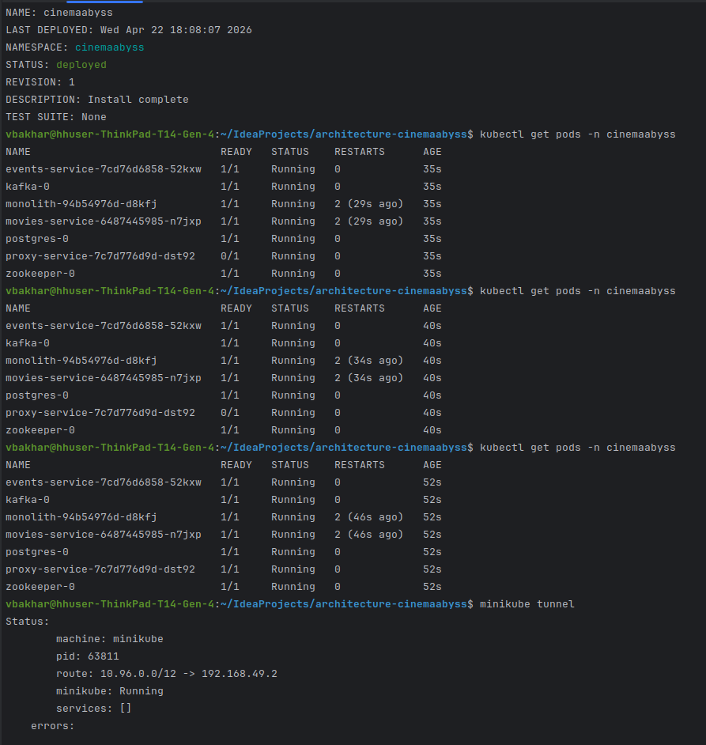
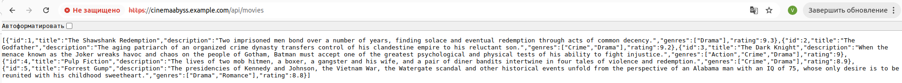

## Изучите [README.md](.\README.md) файл и структуру проекта.

# Задание 1

Диаграмма контейнеров to-be:

# Задание 2

Успешно пройденные тесты:

Соостояние топика movies-event:

Соостояние топика payment-event:

Соостояние топика user-event:

# Задание 3

Результат запроса http://cinemaabyss.example.com/api/movies:

Events лог:

# Задание 4
Развертывание HELM:

Результат запроса:

